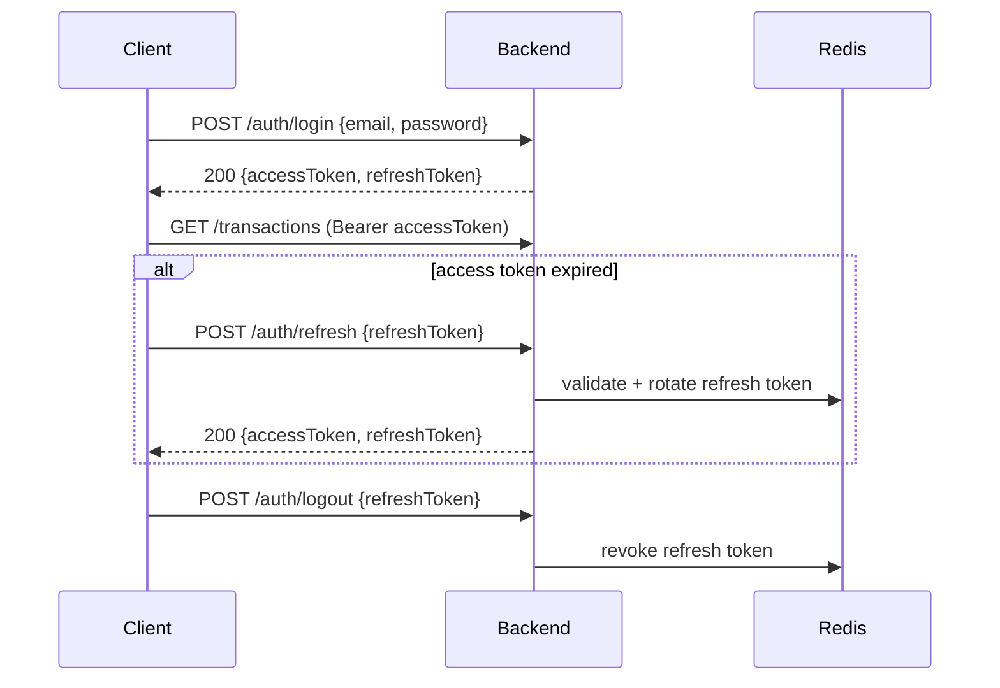

# API Specification — Expense App

> REST API for the Expense App backend.
> References: `docs/DATABASE.md` (fields/entities) · `docs/BE-ARCHITECTURE.md` · `docs/BE-PROJECT-RULES.md` (envelope + errors) · `IDEA.md` (product flows).

## 1. Overview

| Item | Decision |
|---|---|
| Base URL | `https://api.expenseapp.com/api/v1` (dev: `http://localhost:8080/api/v1`) |
| Versioning | URI versioning (`/api/v1/...`) — breaking changes bump to `/api/v2` |
| Content-Type | `application/json; charset=UTF-8` (request + response). Uploads: `multipart/form-data` |
| IDs | UUID strings (mirror `BINARY(16)` PKs in `docs/DATABASE.md`) |
| Resource paths | singular feature names: `/transactions`, `/categories`, `/accounts`, `/budgets`; admin scope under `/admin/*` |

## 2. Authentication

- **Method:** JWT Bearer + Refresh Token (Redis-backed).
- **Header:** `Authorization: Bearer <accessToken>`.
- **Access token:** short-lived (15 min, `expiresIn: 900`). **Refresh token:** long-lived (7 days, stored in Redis).



- **Auth errors:** all return `401` — see `AUTH_*` codes (§5). Token always from the authenticated principal (`@CurrentUser`); clients never send `user_id`.
- **Admin role:** endpoints under `/admin/*` (§6) require `role = ADMIN` in the token (seeded via migration/script — never via `/auth/register`, which always creates `role = USER`). Non-admin → `403 ADMIN_1001`.

## 3. Request Conventions

| Concern | Convention |
|---|---|
| Pagination | `page` (0-based), `size` (default 20, max 100) |
| Sorting | `sort=<field>,<asc\|desc>` — repeatable, e.g. `sort=transactionDate,desc` |
| Filtering | query params: `type=EXPENSE`, `categoryId=<uuid>`, `accountId=<uuid>`, `from=YYYY-MM-DD`, `to=YYYY-MM-DD` |
| Date format | ISO `YYYY-MM-DD` (`transactionDate`) — matches DB `DATE` column |
| Money | JSON **string**, 2 decimals (`"amount": "35000.00"`) — matches DB `DECIMAL(14,2)`; clients parse with a decimal-safe lib (`decimal.js`/`big.js`), never `Number()` |
| Body fields | `camelCase`, mirror DB `snake_case` columns (e.g. `transactionDate` ↔ `transaction_date`) |
| User scoping | every user resource is scoped to the authenticated user; 404 (not 403) when not owned |

## 4. Response Format

**Success**
```json
{
  "success": true,
  "data": { },
  "message": "OK",
  "timestamp": "2026-08-30T10:15:30Z"
}
```
Paginated `data` = `PageResult`:
```json
{ "items": [ ], "page": 0, "size": 20, "totalElements": 142, "totalPages": 8 }
```

**Error**
```json
{
  "success": false,
  "error": { "code": "TRANSACTION_1001", "message": "Transaction not found", "details": [] },
  "timestamp": "2026-08-30T10:15:30Z"
}
```
`details` carries per-field validation messages. Envelope aligns with `ApiResponse<T>` / `PageResult` in `docs/BE-PROJECT-RULES.md`.

## 5. Error Codes

Format: `[FEATURE]_[NUMBER]`. `details` = structured field errors on `400`.

| Code | HTTP | Meaning |
|---|---|---|
| VALIDATION_1001 | 400 | Request validation failed (details = field errors) |
| AUTH_1001 | 401 | Invalid email or password |
| AUTH_1002 | 401 | Access token expired |
| AUTH_1003 | 401 | Invalid / malformed token |
| AUTH_1004 | 401 | Refresh token revoked or expired |
| AUTH_1005 | 409 | Email already registered |
| ADMIN_1001 | 403 | Admin role required |
| ACCOUNT_1001 | 404 | Account not found |
| ACCOUNT_1002 | 409 | Cannot delete the default account |
| ACCOUNT_1003 | 409 | Cannot delete an account with existing transactions |
| CATEGORY_1001 | 404 | Category not found |
| CATEGORY_1002 | 409 | Cannot delete a category in use |
| TRANSACTION_1001 | 404 | Transaction not found |
| BUDGET_1001 | 404 | Budget not found |
| BUDGET_1002 | 409 | Budget already exists for this category + period |
| BUDGET_1003 | 409 | Budget was modified by another device (version conflict) |
| NOT_FOUND_1001 | 404 | Generic resource not found |
| INTERNAL_1001 | 500 | Unexpected server error |

## 6. Endpoints by Feature

### Feature: Auth
| Method | Path | Description | Auth |
|---|---|---|---|
| POST | `/auth/register` | Create user (`role = USER` only) + default "Ví chính" account + system categories | No |
| POST | `/auth/login` | Email + password → token pair | No |
| POST | `/auth/refresh` | Refresh access token | Refresh |
| POST | `/auth/logout` | Revoke refresh token | Yes |
| GET | `/auth/me` | Current user profile (incl. `role`) | Yes |

### Feature: Account (Wallet)
| Method | Path | Description | Auth |
|---|---|---|---|
| GET | `/accounts` | List accounts (MVP: default wallet) | Yes |
| POST | `/accounts` | Create account (UI hidden in MVP) | Yes |
| GET | `/accounts/{id}` | Account detail | Yes |
| PATCH | `/accounts/{id}` | Update name/type | Yes |
| DELETE | `/accounts/{id}` | Delete (fails if default or has transactions) | Yes |

### Feature: Category
| Method | Path | Description | Auth |
|---|---|---|---|
| GET | `/categories` | List (system + user's), `?type=` filter | Yes |
| POST | `/categories` | Create custom category | Yes |
| PATCH | `/categories/{id}` | Update custom category | Yes |
| DELETE | `/categories/{id}` | Delete (fails if in use) | Yes |

### Feature: Transaction (core)
| Method | Path | Description | Auth |
|---|---|---|---|
| POST | `/transactions` | Create transaction (client-generated `id`, upsert-idempotent) | Yes |
| GET | `/transactions` | List + filter + paginate | Yes |
| GET | `/transactions/{id}` | Detail | Yes |
| PATCH | `/transactions/{id}` | Update | Yes |
| DELETE | `/transactions/{id}` | Delete | Yes |
| POST | `/transactions/{id}/duplicate` | "Lặp lại giao dịch" — copy with new date (MVP recurring, per `IDEA.md` §24.4) | Yes |

### Feature: Budget
| Method | Path | Description | Auth |
|---|---|---|---|
| GET | `/budgets?month=&year=` | List budgets for period — each item includes `version` (client sends it back on PATCH) | Yes |
| POST | `/budgets` | Set budget (category + month/year) → returns `version = 0` | Yes |
| PATCH | `/budgets/{id}` | Update amount — send current `version` (optimistic lock) | Yes |
| DELETE | `/budgets/{id}` | Remove budget | Yes |
| GET | `/budgets/{id}/progress` | Spent vs amount + status (`OK`/`WARN`/`EXCEEDED`) + `version` | Yes |

### Feature: Analytics / Dashboard
| Method | Path | Description | Auth |
|---|---|---|---|
| GET | `/analytics/summary?month=&year=` | Balance, income, expense, top categories (dashboard 3 questions) | Yes |
| GET | `/analytics/monthly?year=` | Monthly spend trend (bar chart) | Yes |
| GET | `/analytics/categories?month=&year=` | Category distribution % | Yes |
| GET | `/analytics/compare?month=&year=` | vs previous month (per-category +/-%) | Yes |

### Feature: Admin (Web)
| Method | Path | Description | Auth |
|---|---|---|---|
| GET | `/admin/users` | List all users + filter + paginate | Admin |
| PATCH | `/admin/users/{id}/status` | Activate / deactivate a user | Admin |
| GET | `/admin/stats` | System stats (total users, active users, total transactions) | Admin |
| GET | `/admin/categories` | List system categories (`is_system = true`) | Admin |
| POST | `/admin/categories` | Create system category | Admin |
| PATCH | `/admin/categories/{id}` | Update system category | Admin |
| DELETE | `/admin/categories/{id}` | Delete system category | Admin |

### Feature: Future (v0.2/v0.3)
| Method | Path | Description | Auth |
|---|---|---|---|
| CRUD | `/recurring-transactions` (v0.2) | Recurring templates | Yes |
| CRUD | `/notifications` (v0.2) | List + mark read | Yes |
| POST | `/attachments` (v0.2) | Upload receipt (`multipart/form-data`) | Yes |
| GET | `/admin/audit-logs` (web/admin) | Admin audit trail | Admin |
| GET | `/ai/insights` (v0.3) | AI spending insights | Yes |

## 7. Endpoint Details

### POST `/auth/login`
```json
// Request
{ "email": "user@example.com", "password": "secret" }

// 200
{
  "success": true,
  "data": {
    "accessToken": "eyJhbGciOiJIUzI1NiIs...",
    "refreshToken": "6f9c8d3a-...",
    "tokenType": "Bearer",
    "expiresIn": 900
  },
  "message": "OK",
  "timestamp": "2026-08-30T10:15:30Z"
}

// 401 → { "success": false, "error": { "code": "AUTH_1001", "message": "Invalid email or password", "details": [] }, "timestamp": "..." }
```

### POST `/transactions` — client-generated id (idempotent)
```json
// Request — `id` is a client-generated UUID (REQUIRED; doubles as the idempotency key)
{
  "id": "b6d7e4f5-...",
  "accountId": "0f8f1a2b-...",
  "categoryId": "3fa8c1d2-...",
  "type": "EXPENSE",
  "amount": "35000.00",
  "note": "Coffee",
  "transactionDate": "2026-08-30"
}

// 201 (created) — or 200 (idempotent replay: id already exists → returns the existing record)
{
  "success": true,
  "data": {
    "id": "b6d7e4f5-...",
    "accountId": "0f8f1a2b-...",
    "categoryId": "3fa8c1d2-...",
    "type": "EXPENSE",
    "amount": "35000.00",
    "note": "Coffee",
    "transactionDate": "2026-08-30",
    "createdAt": "2026-08-30T10:15:30Z"
  },
  "message": "Transaction created",
  "timestamp": "2026-08-30T10:15:30Z"
}
```
Error cases: `400 VALIDATION_1001` (missing `id`, amount ≤ 0, invalid `type`/UUID), `404 ACCOUNT_1001` / `404 CATEGORY_1001`.

### GET `/transactions?type=EXPENSE&from=2026-08-01&to=2026-08-31&page=0&size=20&sort=transactionDate,desc`
```json
{
  "success": true,
  "data": {
    "items": [
      { "id": "b6d7...", "amount": "35000.00", "categoryId": "3fa8...", "type": "EXPENSE", "note": "Coffee", "transactionDate": "2026-08-30" }
    ],
    "page": 0, "size": 20, "totalElements": 142, "totalPages": 8
  },
  "message": "OK",
  "timestamp": "2026-08-30T10:15:30Z"
}
```

### GET `/analytics/summary?month=8&year=2026`
```json
{
  "success": true,
  "data": {
    "balance": "8450000.00",
    "income": "15000000.00",
    "expense": "6550000.00",
    "budgetUsage": 0.72,
    "topCategories": [
      { "categoryId": "3fa8...", "name": "Ăn uống", "icon": "🍜", "amount": "2100000.00", "percent": 0.32 }
    ]
  },
  "message": "OK",
  "timestamp": "2026-08-30T10:15:30Z"
}
```

### PATCH `/budgets/{id}` — optimistic lock
```json
// Request — send the current `version` you hold
{ "amount": "3000000.00", "version": 3 }

// 200 → server increments version
{
  "success": true,
  "data": {
    "id": "9a1b...", "categoryId": "3fa8...", "amount": "3000000.00",
    "month": 8, "year": 2026, "version": 4
  },
  "message": "Budget updated",
  "timestamp": "2026-08-30T10:15:30Z"
}

// 409 → version mismatch (someone else updated it first)
{ "success": false, "error": { "code": "BUDGET_1003", "message": "Budget was modified by another device", "details": [] }, "timestamp": "..." }
```

## Format
- Group by feature · tables for endpoint list · JSON blocks for examples. Concise, English.

## Tech-Specific Additions (Spring Boot / OpenAPI)

- **OpenAPI/Swagger:** `springdoc-openapi` at `/swagger-ui.html` (dev only). Annotate with `@Tag` (feature) + `@Operation`.
- **Response envelope:** controllers return `ApiResponse<T>` / `PageResult<T>` (see `docs/BE-PROJECT-RULES.md` §4).
- **Idempotency:** built into the client-generated `id` — the server upserts by id, so a retried `POST /transactions` with the same id returns the existing record (no duplicate, no separate header needed).
- **Not in scope (MVP):** GraphQL, WebSocket, gRPC. SSE for push notifications deferred to v0.2 (`/notifications/stream`).
