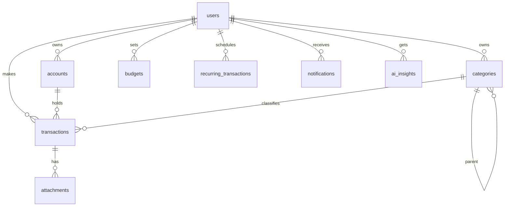

# Database Design — Expense App

> MySQL schema for the Expense App. Covers MVP tables plus planned tables (marked v0.2/v0.3).
> Product decisions: see `IDEA.md`.

## Core Features
- **Authentication** → `users`
- **Wallet / Accounts** → `accounts`
- **Category Management** → `categories`
- **Transaction Management** → `transactions`
- **Budget** → `budgets`
- **Recurring Transactions** (v0.2) → `recurring_transactions`
- **Notifications** (v0.2) → `notifications`
- **Attachments** (v0.2) → `attachments`
- **Audit Logs** (web/admin) → `audit_logs`
- **AI Insights** (v0.3) → `ai_insights`

## Requirements

### 1. Overview

| Item | Decision |
|---|---|
| Database | MySQL 8.0 — InnoDB, `utf8mb4_unicode_ci` |
| Cache | Redis 7 (refresh-token storage, analytics cache — not in relational schema) |
| ORM | Spring Data JPA (Hibernate 6) |
| Tables | `snake_case`, plural |
| Columns | `snake_case` |
| Indexes | `idx_<table>_<col>`; unique: `uk_<table>_<col>` |
| FK columns | `<entity>_id` (e.g. `user_id`, `category_id`) |

### 2. Entities by Feature

#### Feature: Authentication — `users`

| Column | Type | Constraints |
|---|---|---|
| id | BINARY(16) | PK (UUID) |
| email | VARCHAR(255) | NOT NULL, UNIQUE |
| password_hash | VARCHAR(255) | NOT NULL (BCrypt) |
| name | VARCHAR(100) | NOT NULL |
| avatar_url | VARCHAR(500) | NULL |
| currency | CHAR(3) | NOT NULL, DEFAULT 'VND' |
| status | VARCHAR(20) | NOT NULL, DEFAULT 'ACTIVE' |
| role | VARCHAR(20) | NOT NULL, DEFAULT 'USER' (USER / ADMIN) |
| created_at | DATETIME(6) | NOT NULL |
| updated_at | DATETIME(6) | NOT NULL |
| deleted_at | DATETIME(6) | NULL (soft delete) |

Indexes: `uk_users_email` (email)

Notes: First ADMIN account is seeded via migration/script — never via `/auth/register` (register always creates `role = USER`).

#### Feature: Wallet / Accounts — `accounts`

| Column | Type | Constraints |
|---|---|---|
| id | BINARY(16) | PK (UUID) |
| user_id | BINARY(16) | NOT NULL, FK → users.id |
| name | VARCHAR(50) | NOT NULL |
| type | VARCHAR(20) | NOT NULL (CASH / BANK / EWALLET / CREDIT_CARD) |
| balance | DECIMAL(14,2) | NOT NULL, DEFAULT 0 |
| currency | CHAR(3) | NOT NULL, DEFAULT 'VND' |
| is_default | TINYINT(1) | NOT NULL, DEFAULT 0 |
| created_at | DATETIME(6) | NOT NULL |
| updated_at | DATETIME(6) | NOT NULL |

Indexes: `idx_accounts_user_id` (user_id)

Notes: One default account **"Ví chính"** auto-created on registration. Wallet UI hidden in MVP (`account_id` reserved on transactions). `balance` is maintained by `AccountBalanceUpdateListener` in the same DB transaction as transaction writes (see `docs/BE-ARCHITECTURE.md` §5).

#### Feature: Categories — `categories`

| Column | Type | Constraints |
|---|---|---|
| id | BINARY(16) | PK (UUID) |
| user_id | BINARY(16) | NULL, FK → users.id (NULL = system default) |
| parent_id | BINARY(16) | NULL, FK → categories.id (sub-category) |
| name | VARCHAR(50) | NOT NULL |
| icon | VARCHAR(50) | NULL (emoji / icon key) |
| type | VARCHAR(20) | NOT NULL (INCOME / EXPENSE) |
| is_system | TINYINT(1) | NOT NULL, DEFAULT 0 |
| sort_order | INT | NOT NULL, DEFAULT 0 |
| created_at | DATETIME(6) | NOT NULL |
| updated_at | DATETIME(6) | NOT NULL |

Indexes: `idx_categories_user_id` (user_id), `idx_categories_parent_id` (parent_id)

Notes: ~12 system EXPENSE categories + 1 "Thu nhập" (INCOME) seeded on registration; users can add custom ones.

#### Feature: Transactions — `transactions`

| Column | Type | Constraints |
|---|---|---|
| id | BINARY(16) | PK (UUID) |
| user_id | BINARY(16) | NOT NULL, FK → users.id |
| account_id | BINARY(16) | NOT NULL, FK → accounts.id |
| category_id | BINARY(16) | NULL, FK → categories.id |
| type | VARCHAR(20) | NOT NULL (INCOME / EXPENSE) |
| amount | DECIMAL(14,2) | NOT NULL, > 0 |
| note | VARCHAR(500) | NULL |
| transaction_date | DATE | NOT NULL |
| created_at | DATETIME(6) | NOT NULL |
| updated_at | DATETIME(6) | NOT NULL |

Indexes: `idx_transactions_user_date` (user_id, transaction_date), `idx_transactions_category` (category_id)

Notes: `id` is client-generated (offline writes) — see §4 PK strategy.

#### Feature: Budgets — `budgets`

| Column | Type | Constraints |
|---|---|---|
| id | BINARY(16) | PK (UUID) |
| user_id | BINARY(16) | NOT NULL, FK → users.id |
| category_id | BINARY(16) | NOT NULL, FK → categories.id |
| amount | DECIMAL(14,2) | NOT NULL |
| month | TINYINT | NOT NULL (1–12) |
| year | SMALLINT | NOT NULL |
| version | BIGINT | NOT NULL, DEFAULT 0 (@Version, optimistic lock) |
| created_at | DATETIME(6) | NOT NULL |
| updated_at | DATETIME(6) | NOT NULL |

Indexes: `uk_budgets_user_cat_period` (user_id, category_id, month, year)

#### Feature: Recurring Transactions (v0.2) — `recurring_transactions`

| Column | Type | Constraints |
|---|---|---|
| id | BINARY(16) | PK (UUID) |
| user_id | BINARY(16) | NOT NULL, FK → users.id |
| account_id | BINARY(16) | NOT NULL, FK → accounts.id |
| category_id | BINARY(16) | NULL, FK → categories.id |
| amount | DECIMAL(14,2) | NOT NULL |
| note | VARCHAR(500) | NULL |
| frequency | VARCHAR(20) | NOT NULL (MONTHLY) |
| start_date | DATE | NOT NULL |
| end_date | DATE | NULL |
| active | TINYINT(1) | NOT NULL, DEFAULT 1 |
| created_at | DATETIME(6) | NOT NULL |
| updated_at | DATETIME(6) | NOT NULL |

Indexes: `idx_recurring_user_active` (user_id, active)

#### Feature: Notifications (v0.2) — `notifications`

| Column | Type | Constraints |
|---|---|---|
| id | BINARY(16) | PK (UUID) |
| user_id | BINARY(16) | NOT NULL, FK → users.id |
| type | VARCHAR(30) | NOT NULL (BUDGET_WARNING, ...) |
| title | VARCHAR(150) | NOT NULL |
| body | VARCHAR(500) | NULL |
| read_at | DATETIME(6) | NULL |
| created_at | DATETIME(6) | NOT NULL |

Indexes: `idx_notifications_user_read` (user_id, read_at)

#### Feature: Attachments (v0.2) — `attachments`

| Column | Type | Constraints |
|---|---|---|
| id | BINARY(16) | PK (UUID) |
| user_id | BINARY(16) | NOT NULL, FK → users.id |
| transaction_id | BINARY(16) | NOT NULL, FK → transactions.id |
| url | VARCHAR(500) | NOT NULL (object storage) |
| mime_type | VARCHAR(50) | NOT NULL |
| size_bytes | BIGINT | NOT NULL |
| created_at | DATETIME(6) | NOT NULL |

Indexes: `idx_attachments_transaction` (transaction_id)

#### Feature: Audit & Admin (web) — `audit_logs`

| Column | Type | Constraints |
|---|---|---|
| id | BIGINT | PK, AUTO_INCREMENT (sequential) |
| actor_user_id | BINARY(16) | NULL, FK → users.id |
| action | VARCHAR(50) | NOT NULL (e.g. TRANSACTION_DELETE) |
| entity | VARCHAR(50) | NOT NULL |
| entity_id | VARCHAR(64) | NOT NULL |
| payload | JSON | NULL (before/after) |
| created_at | DATETIME(6) | NOT NULL |
| deleted_at | DATETIME(6) | NULL (soft delete) |

Indexes: `idx_audit_entity` (entity, entity_id), `idx_audit_created` (created_at)

Notes: Append-only, server-generated IDs (no offline need). Consumed by web admin.

#### Feature: AI Insights (v0.3) — `ai_insights`

| Column | Type | Constraints |
|---|---|---|
| id | BINARY(16) | PK (UUID) |
| user_id | BINARY(16) | NOT NULL, FK → users.id |
| type | VARCHAR(30) | NOT NULL (SPENDING_TREND, ...) |
| period_month | TINYINT | NULL |
| period_year | SMALLINT | NULL |
| summary | TEXT | NOT NULL |
| meta | JSON | NULL |
| created_at | DATETIME(6) | NOT NULL |

Indexes: `idx_ai_user_period` (user_id, period_year, period_month)

### 3. Relationships

- FK naming: `<entity>_id`; every FK column is indexed.
- Cross-feature: `transactions` links `users` + `accounts` + `categories`; `budgets` links `users` + `categories`.
- No cross-user references (personal app; shared wallets out of scope).

### 4. Conventions

- **Primary key**: UUID `BINARY(16)`.
  - **Default (most tables — users, accounts, categories, budgets…):** server-generated UUID (`@UuidGenerator`); created online.
  - **`transactions.id`:** client-assigned UUID — generated by the client for offline writes; the server trusts the client id and upserts (idempotent — a retried create with the same id returns the existing record). No `@GeneratedValue`.
  - **`audit_logs.id`:** `BIGINT AUTO_INCREMENT` (append-only, server-side).
- **Soft delete**: `deleted_at` on `users` + `audit_logs` only. Transactions are hard-deleted; audit trail preserved in `audit_logs`.
- **Timestamps**: `created_at` + `updated_at` on every mutable table (`DATETIME(6)`), managed via `@CreationTimestamp` / `@UpdateTimestamp`.
- **Enum/Status**: VARCHAR columns + Java enums (`@Enumerated(EnumType.STRING)`). Never MySQL `ENUM` (hard to migrate).
- **Money**: `DECIMAL(14,2)`. Multi-currency out of MVP scope; `currency` column reserved.
- **Concurrency**: `@Version` optimistic locking on `budgets` (multi-device overwrites).

### 5. Migration Rules

- **Tool**: Flyway
- **Naming**: `V{version}__{description}.sql` — e.g. `V1__create_users.sql`, `V2__create_transactions.sql`
- **Versioning**: sequential; never edit an applied migration — add a new one.
- **Rollback**: no down-migrations by default (recover via a corrective migration). Flyway validates checksums on startup.

## Tech-Specific Additions (JPA / Hibernate + MySQL)

- `@Entity` + `@Table(name = "...")`; explicit `@Column(name = "...")` for all fields.
- UUID: most entities `@Id @UuidGenerator @Column(columnDefinition = "BINARY(16)")`; `transactions` uses `@Id @Column(columnDefinition = "BINARY(16)")` (client-assigned, no `@GeneratedValue`).
- Enums: `@Enumerated(EnumType.STRING)`.
- Timestamps: `@CreationTimestamp` / `@UpdateTimestamp` on `LocalDateTime`.
- Optimistic lock: `@Version private Long version;`.
- JSON columns (`audit_logs.payload`, `ai_insights.meta`): Hibernate `@JdbcTypeCode(SqlTypes.JSON)`.
- MySQL: InnoDB + `utf8mb4_unicode_ci` everywhere; `DATETIME(6)` for timestamps, `DATE` for `transaction_date`.
- Redis (outside schema): refresh-token storage + cache for dashboard/analytics reads.
