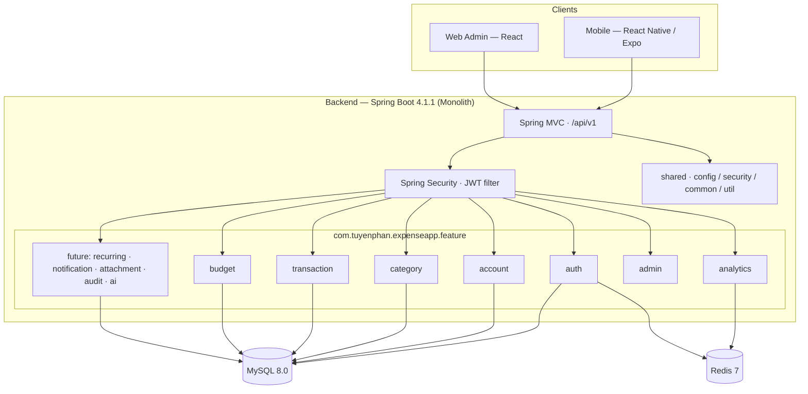

# Backend Architecture — Expense App

> Feature-based Spring Boot architecture.
> References: `docs/DATABASE.md` · `docs/BE-PROJECT-RULES.md` · `IDEA.md` §14.

## 1. System Overview



**Feature-based rationale:** each domain (transaction, budget, category…) is one self-contained package — its controller, service, repository, DTOs, entity live together. This keeps new-team onboarding and AI-assisted changes local to one feature, and prevents layer-chaos as scope grows (MVP → v0.2 → v0.3 in `IDEA.md`). Shared, cross-cutting concerns live in `shared/`.

## 2. Folder Structure

```
src/main/java/com/expenseapp/
├── ExpenseappApplication.java
├── shared/                          ← cross-cutting, used by 2+ features
│   ├── config/      SecurityConfig · RedisConfig · OpenApiConfig
│   ├── security/    JwtService · JwtAuthFilter · CurrentUser
│   ├── common/      ApiResponse · GlobalExceptionHandler · PageResult
│   └── util/        MoneyUtils · DateUtils
└── feature/
    ├── auth/                        ← register · login · refresh · profile
    ├── account/                     ← wallet (model in MVP, UI hidden)
    ├── category/                    ← system + custom categories
    ├── transaction/                 ← core: create/update/delete/history
    ├── budget/                      ← set + track + warn/overspend
    ├── analytics/                   ← dashboard + monthly/category reports
    ├── admin/                       ← web admin: /admin/users · /admin/stats · /admin/categories (delegates to feature services)
    └── recurring/ · notification/ · attachment/ · audit/ · ai/   (v0.2/v0.3)

src/main/resources/
├── application.yml · application-dev.yml · application-prod.yml
└── db/migration/                    ← Flyway: V1__create_users.sql …
src/test/java/com/expenseapp/feature/<name>/  ← tests per feature
```

Adjustments vs generic template: `core/` is folded into `shared/config` (infra beans); "middleware" → Spring Filters/`@ControllerAdvice`; "types" → `common/` + `dto/` per feature.

## 3. Feature Anatomy

```
feature/transaction/
├── TransactionController.java    routing · @Valid · response formatting
├── TransactionService.java       business logic · @Transactional
├── TransactionRepository.java    data access only (JpaRepository)
├── dto/                          CreateTransactionRequest · UpdateTransactionRequest · TransactionResponse
├── entity/Transaction.java       maps to table `transactions`
├── event/TransactionCreatedEvent.java   (publish for budget/analytics)
└── TransactionContext.md         2–5 lines: purpose, flows, cross-feature touches
```

- Controller never touches repository/entity. Service depends on interfaces.
- Entity fields mirror `docs/DATABASE.md` columns (`snake_case` → `camelCase`).

## 4. Request Flow

```
Request → [JwtAuthFilter] → Controller → Service → Repository → MySQL
                                    │              │
                                    │              └─ cache hit/miss → Redis (analytics)
                                    ▼
                               ApiResponse<T>
```

- **Controller**: routing, `@Valid` validation, maps request → DTO, delegates, returns `ApiResponse`.
- **Service**: business rules, `@Transactional`, throws domain exceptions, publishes events.
- **Repository**: `JpaRepository` only — no business logic, no `EntityManager` outside it.
- Cross-cutting run before Controller: `JwtAuthFilter` (auth) → `@ControllerAdvice` (errors).

## 5. Cross-feature Communication

| Allowed | Example |
|---|---|
| Shared services | `common.ApiResponse` used by every feature |
| Events (`ApplicationEventPublisher`) | `transaction` publishes `TransactionCreatedEvent`/`TransactionUpdatedEvent`/`TransactionDeletedEvent` → `budget`/`analytics` listeners + `AccountBalanceUpdateListener` (updates `accounts.balance` in the same DB transaction) |
| DI via public service interfaces | `analytics` calls `TransactionService` (interface) by `userId` — never its internals |

**Forbidden:** direct internal imports — `import com.tuyenphan.expenseapp.feature.budget.BudgetServiceImpl;`

`admin` is a thin orchestration feature: it owns only its controllers/DTOs and calls `auth` (users), `category`, and `transaction` services via their **public Service interfaces only** — never their internals.

## 6. Shared vs Core

| Shared (`shared/common`, `shared/util`) | Core / Infra (`shared/config`, `shared/security`) |
|---|---|
| Reusable helpers: `MoneyUtils`, `DateUtils` | Infrastructure beans: `SecurityConfig`, `RedisConfig` |
| Common response/envelope: `ApiResponse`, `PageResult` | DB + Flyway + connection setup |
| Global error mapping: `GlobalExceptionHandler` | Logging setup (SLF4J config) |
| — | Auth infra: `JwtService`, `JwtAuthFilter` |

Rule: an item goes into `shared/` **only when 2+ features use it** — otherwise it stays feature-local (YAGNI, per `docs/BE-PROJECT-RULES.md`).

## 7. Configuration Management

- **Profiles:** `application.yml` (common) + `application-dev.yml` + `application-prod.yml` (activated via `SPRING_PROFILES_ACTIVE`).
- **Env vars** (never committed): `DB_URL`, `DB_USER`, `DB_PASSWORD`, `JWT_SECRET`, `JWT_EXPIRATION_MS`, `REDIS_HOST`, `REDIS_PORT`.
- **Secrets:** local `.env` (gitignored); production values injected by CI/deploy env; `JWT_SECRET` ≥ 256-bit.
- **Migration:** Flyway runs on startup against `db/migration/` (see `docs/DATABASE.md` §5).

## Format
- Mermaid diagrams + folder structure with comments. Max 200 lines.

## Tech-Specific Additions (Spring Boot 4 / JPA)

### Modules (dependencies)
- `spring-boot-starter-web` · `-data-jpa` · `-security` · `-validation` · `-data-redis`
- `flyway-core` · `mysql-connector-j` · Lombok · `testcontainers` (test)

### DI / Middleware chain
- Constructor injection via `@RequiredArgsConstructor`; beans annotated `@Service` / `@Repository` / `@Component`.
- Chain: `JwtAuthFilter` (OncePerRequestFilter) → Controller → `@ControllerAdvice` (`GlobalExceptionHandler`).
- `@Transactional` at service layer; `@Transactional(readOnly = true)` for reads.

### JPA specifics
- UUID PK — server-generated for most entities, client-assigned for `transactions` (see `docs/DATABASE.md` §4); enums `@Enumerated(EnumType.STRING)`; `@Version` on `Budget`; JSON via `@JdbcTypeCode(SqlTypes.JSON)`; all aligned with `docs/DATABASE.md`.

### Async / scheduled (future)
- `@EnableAsync` + `@Async` for event listeners (notifications, analytics recompute).
- `@Scheduled` reserved for v0.2 recurring-transaction generation — not in MVP (see `IDEA.md` §24.4).
