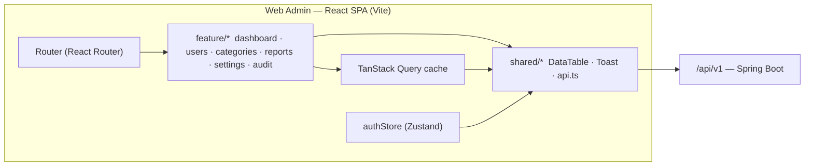

# Web Admin Architecture — Expense App

> Feature-based architecture for the Web Admin console.
> References: `docs/API_SPEC.md` · `docs/WEB-PROJECT-RULES.md` · `IDEA.md` §2.

## 1. Overview



**Rationale:** the admin console is a management SPA, not the primary product (`IDEA.md` §2). It is deliberately lighter than mobile: no offline, no local DB, no sync. Feature-based organization keeps each admin module (users, categories, reports…) self-contained; TanStack Query centralizes server state; Vite SPA (no SSR needed — admin-only, internal). All admin reads/writes use the `/admin/*` API group (`docs/API_SPEC.md` §6), which requires the ADMIN role.

## 2. Folder Structure

```
src/
├── app/
│   ├── main.tsx            entry
│   ├── router.tsx          route config + lazy loading
│   └── providers.tsx       QueryClientProvider · Router · ErrorBoundary
├── shared/
│   ├── components/  DataTable · Toast · ConfirmDialog · StatCard
│   ├── hooks/       useDebounce · usePagination
│   ├── services/    api.ts (axios client + interceptors)
│   ├── stores/      authStore · uiStore
│   ├── types/       ApiResponse · PageResult
│   └── utils/       formatVnd · formatDate
├── features/
│   ├── auth/        login page · profile
│   ├── dashboard/   stat cards · recent activity
│   ├── users/       user table · detail · status toggle
│   ├── categories/  category table · CRUD dialog
│   ├── reports/     monthly · category charts
│   ├── settings/    system settings form
│   └── audit/       audit log table
├── assets/
└── styles/          Tailwind + theme tokens
```

## 3. Feature Anatomy

```
features/users/
├── UserTable.tsx            main grid (TanStack Table)
├── UserStatusBadge.tsx
├── UserDetailDialog.tsx
├── useUsers.ts              TanStack Query hook → userService
├── userService.ts           GET/PATCH /api/v1/admin/users
├── users.types.ts           User, UserStatus, Filters
├── utils/userStatusLabel.ts
├── index.ts                 barrel
└── context.md
```

## 4. Data Flow

```
User Action → Component → useQuery/useMutation hook → userService → api.ts (axios) → /api/v1
                              ↓
                        React Query cache → re-render → UI Update
```

- Component = pure presentation; hooks own data; services own HTTP; `api.ts` owns the envelope.

## 5. Cross-feature Communication

| Method | Use case |
|---|---|
| Global store (`authStore`, `uiStore`) | Auth/session, sidebar/theme |
| Router + params | Navigate to user detail from dashboard; filters in URL |
| Event emitter (rare) | "User deactivated" → refresh dashboard counters |

## 6. Routing Structure

- **Public:** `/login`.
- **Protected (admin):** layout with sidebar/nav → `/dashboard`, `/users`, `/categories`, `/reports`, `/settings`, `/audit`.
- **Guard:** `<RequireAdmin>` reads `authStore`; role `ADMIN` required (`docs/WEB-PROJECT-RULES.md` §Tech).
- **Lazy:** `React.lazy(() => import('./features/reports'))` — route-level code splitting.

## 7. State Management Strategy

| State Type | Location | Example |
|---|---|---|
| Server state | TanStack Query | `/api/v1/analytics/*`, user lists |
| Auth | `authStore` (Zustand) | tokens, `user.role` |
| Global UI | `uiStore` (Zustand) | theme, sidebar collapsed |
| Feature state | Feature-local store/hook | report filter drafts |
| Local UI | `useState` | modal open/close |

Rule: server state NEVER duplicated in Zustand — single source is the React Query cache (see `docs/WEB-PROJECT-RULES.md` §5).

## 8. API Layer

```
shared/services/api.ts        axios instance + auth header + ApiResponse unwrap + 401 refresh
    ↓
features/users/userService.ts  typed calls (GET /admin/users, PATCH /admin/users/{id}/status)
    ↓
features/users/useUsers.ts     useQuery/useMutation (cache keys, invalidation)
    ↓
features/users/UserTable.tsx   UI
```

## 9. Shared vs Features

| Shared (`src/shared/`) | Features (`src/features/`) |
|---|---|
| `DataTable`, `Toast`, `ConfirmDialog` | `UserTable`, `CategoryFormDialog` |
| `api.ts` client + interceptors | `userService`, `categoryService` |
| `useDebounce`, `usePagination` | `useUsers`, `useCategories` |
| `formatVnd`, `formatDate` | `userStatusLabel` |

## Format
- Mermaid diagrams + folder structure with comments. Max 200 lines.

## Tech-Specific Additions (React / Vite)

- **SSR/SSG:** none — admin-only SPA; static hosting + reverse proxy to `/api/v1`.
- **Charts:** Recharts for `reports` (monthly bar, category donut) — wrapped in `shared/components/charts` for consistent styling.
- **Tables:** TanStack Table (client-side sort/pagination for < 1k rows; server-side `page/size` otherwise, per `docs/API_SPEC.md` §3).
- **Accessibility:** admin is internal but still keyboard-navigable (dialogs, tables) — no inline styles, Tailwind tokens only.
