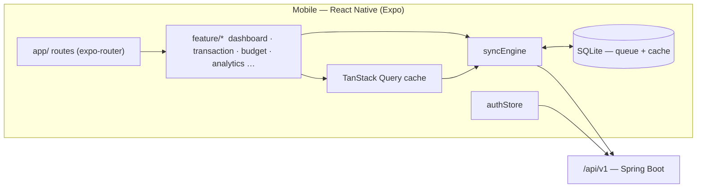
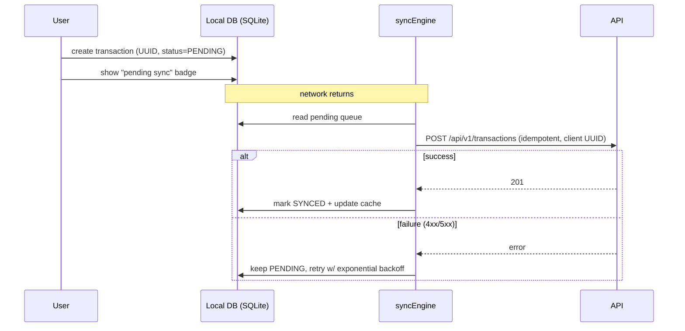

# Mobile App Architecture — Expense App

> Feature-based architecture for the Mobile app (React Native + Expo) — **primary product**.
> References: `docs/API_SPEC.md` · `docs/MOBILE-PROJECT-RULES.md` · `IDEA.md` §15–16, §24.6.

## 1. Overview



**Rationale:** mobile is the primary product (`IDEA.md` §1) — its #1 job is "ghi tiền nhanh" even with no network. So the architecture is **offline-tolerant**: every write goes through a local SQLite queue (`syncEngine`) instead of calling the API directly (`IDEA.md` §24.6). Feature-based + shared/ keeps mobile modules self-contained like the backend. React Native + Expo + TypeScript keeps the ecosystem aligned with web (`IDEA.md` §16).

## 2. Folder Structure

```
src/
├── app/                       expo-router file routes (thin)
│   ├── _layout.tsx            providers + auth guard
│   ├── (tabs)/                dashboard · history · analytics · profile
│   ├── auth/login.tsx · register.tsx
│   └── transaction/new.tsx · history.tsx
├── shared/
│   ├── components/  MoneyInput · Button · CategoryPicker · SyncBadge
│   ├── hooks/       useSyncStatus · useDebounce
│   ├── services/    api.ts · syncEngine.ts
│   ├── stores/      authStore · uiStore
│   ├── types/       ApiResponse · PageResult
│   └── utils/       formatVnd · formatDate · uuid
├── features/
│   ├── auth/        login · register · profile
│   ├── dashboard/   balance · income · expense · budget ring
│   ├── transaction/ add · history · duplicate · AI parse (v0.3)
│   ├── category/    list · custom category
│   ├── budget/      list · set · warn/overspend
│   ├── analytics/   monthly · category distribution
│   ├── account/     wallet (MVP: model exists, UI hidden)
│   └── settings/
├── db/                        local schema: `transactions_local` · `pending_ops` · `meta`
├── assets/
└── styles/
```

## 3. Feature Anatomy

```
features/transaction/
├── TransactionNewScreen.tsx    (route app/transaction/new.tsx re-exports)
├── TransactionForm.tsx
├── CategoryPicker.tsx
├── useCreateTransaction.ts     optimistic → queue → sync
├── useTransactions.ts          TanStack Query (server + local merged)
├── transactionService.ts       queue write + API call
├── transaction.types.ts        Transaction, CreateTransactionInput
├── utils/transactionValidators.ts
├── index.ts
└── context.md
```

## 4. Data Flow (Online)

```
User Action → Screen → hook (useCreateTransaction) → transactionService → api.ts → /api/v1
                          ↓
                    React Query cache → re-render → UI
```

## 5. Offline & Sync Flow



- **Single-direction** sync (user → server), no 2-way conflict in MVP (`IDEA.md` §24.6).
- Idempotency by client UUID → the server upserts by id; a retried `POST /transactions` with the same id returns the existing record (matches the assigned-id contract in `docs/API_SPEC.md`).

## 6. Cross-feature Communication

| Method | Use case |
|---|---|
| Global store (`authStore`, `uiStore`) | Auth/session, theme, sync status |
| Navigation (expo-router) | Screen transitions with params (e.g. `transaction/new?categoryId=`) |
| Events (rare) | `syncEngine` → `useSyncStatus` broadcast |

## 7. Routing Structure

- **Public:** `/auth/login`, `/auth/register`.
- **Protected:** `(tabs)` + modal screens; `_layout.tsx` redirects to `/auth/login` when `authStore.user` is null.
- **Deep linking:** Expo scheme (`expenseapp://`) for future share/notification links.

## 8. State Management Strategy

| State Type | Location | Example |
|---|---|---|
| Server state | TanStack Query | transaction history, categories |
| Local/offline | SQLite (`transactions_local`, `pending_ops`) | unsynced transactions, queue |
| Auth | `authStore` (Zustand) | tokens (AsyncStorage), user |
| Global UI | `uiStore` (Zustand) | theme, sync status |
| Feature state | Feature-local store/hook | new-transaction form draft |
| Local UI | `useState` | picker open/close |

Rule: server state lives in React Query cache; **offline state lives in SQLite** — the two are never conflated (`docs/MOBILE-PROJECT-RULES.md` §5).

## 9. API Layer

```
shared/services/api.ts        axios + auth header + ApiResponse unwrap + 401 refresh
    ↓
features/transaction/transactionService.ts   queue-first write + API sync
    ↓
features/transaction/useCreateTransaction.ts · useTransactions.ts
    ↓
features/transaction/TransactionNewScreen.tsx
```

## 10. Shared vs Features

| Shared (`src/shared/`) | Features (`src/features/`) |
|---|---|
| `MoneyInput`, `Button`, `SyncBadge` | `TransactionForm`, `BudgetRing` |
| `api.ts` + `syncEngine.ts` | `transactionService`, `budgetService` |
| `useSyncStatus`, `useDebounce` | `useCreateTransaction`, `useBudgets` |
| `formatVnd`, `formatDate`, `uuid` | `transactionValidators` |

## Format
- Mermaid diagrams + folder structure with comments. Max 200 lines.

## Tech-Specific Additions (React Native / Expo)

- **Offline sync engine:** `syncEngine.ts` (shared) — flushes `pending_ops` on app start + connectivity change (`@react-native-community/netinfo`); exponential backoff; hooks expose `useSyncStatus` for the "pending sync" badge.
- **Local DB:** `expo-sqlite`; schema mirrors server tables' pending fields (`docs/DATABASE.md`) — `transactions_local`, `pending_ops`, `meta` (last sync time).
- **Platform folders:** `ios/` / `android/` (expo prebuild) — native modules only; all business code in `src/`.
- **Push notifications (v0.2):** Expo Notifications + `/notifications/stream` (SSE) for budget warnings (`IDEA.md` §9).
- **AI input (v0.3):** `transaction` feature AI-parse flow — natural language → parse → confirm → create (`IDEA.md` §13).
